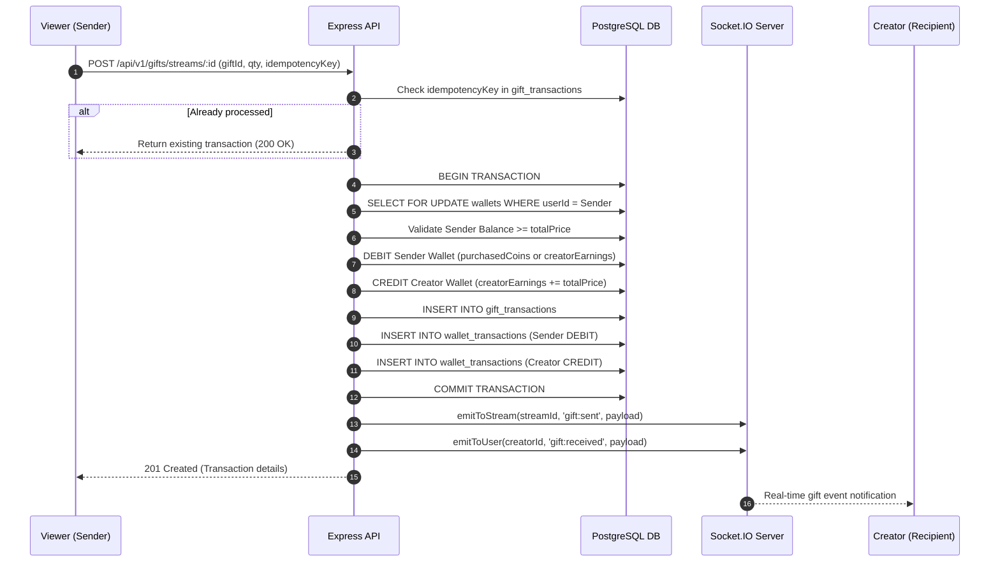
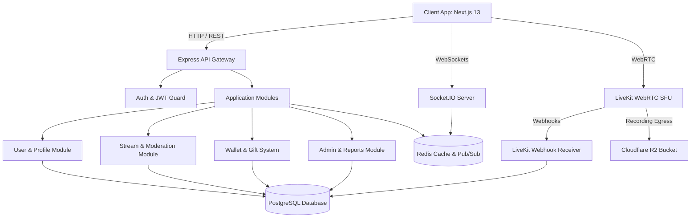
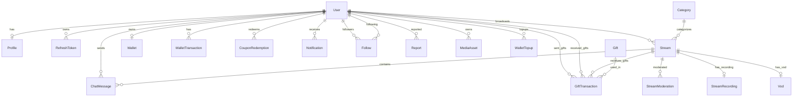

# Zylo — System Architecture Specification

This document details the actual system architecture, component dependencies, real-time streaming pipeline, database transaction models, and security boundaries implemented in the Zylo live streaming codebase.

---

## 1. Current Implementation Architecture

Zylo follows a modular monolithic backend architecture paired with a Next.js App Router client application. 

```text
┌─────────────────────────────────────────────────────────────────────────────┐
│                              CLIENT LAYER                                   │
│  Next.js 13 App Router (React 18 + TanStack Query + Tailwind CSS + Lucide)  │
└──────────────────────┬──────────────────────────────┬───────────────────────┘
                       │ HTTP / REST                  │ Socket.IO / WebSockets
                       ▼                              ▼
┌─────────────────────────────────────────────────────────────────────────────┐
│                               API GATEWAY                                   │
│   Express Router, Helmet Security Headers, CORS Policy, Cookie Parser      │
└──────────────────────┬──────────────────────────────┬───────────────────────┘
                       │                              │
                       ▼                              ▼
┌──────────────────────────────────────┐  ┌───────────────────────────────────┐
│       AUTHENTICATION & GUARDS        │  ┌────────── REAL-TIME LAYER ──────────┤
│  JWT Bearer Auth, Argon2id, RBAC     │  │ Socket.IO Handshake Auth, Rooms,  │
│  Zod Request Payload Validators      │  │ Presence, Chat Rate Limiter       │
└──────────────────┬───────────────────┘  └─────────────────┬─────────────────┘
                   │                                        │
                   ▼                                        ▼
┌─────────────────────────────────────────────────────────────────────────────┐
│                              SERVICE LAYER                                  │
│  Auth, User, Stream, Moderation, Gift/Wallet, Media, Notification Services  │
└───────┬──────────────────────┬───────────────────────┬──────────────────────┘
        │                      │                       │
        ▼                      ▼                       ▼
┌───────────────┐      ┌───────────────┐       ┌───────────────┐
│ DATABASE (DB) │      │  REDIS CACHE  │       │ CLOUD MEDIA   │
│ PostgreSQL    │      │ Cache, Viewer │       │ LiveKit WebRTC│
│ Prisma ORM    │      │ Counting, TTL │       │ R2 / Cloudinary│
└───────────────┘      └───────────────┘       └───────────────┘
```

---

## 2. Request Lifecycle & Layer Breakdown

### HTTP Request Lifecycle

1. **Client Request**: The frontend issues an HTTP request using Axios (`client/lib/api/axios-client.ts`) with `withCredentials: true` and optional `Authorization: Bearer <token>` header.
2. **Global Middleware Pipeline**:
   - `requestIdMiddleware`: Assigns a UUID (`x-request-id`) to track request context.
   - `helmet`: Attaches security headers (`Cross-Origin-Resource-Policy`, `X-Content-Type-Options`, etc.).
   - `cors`: Validates request origin against allowed origins list (`CORS_ORIGINS`).
   - `express.json`: Parses JSON request body (10MB limit).
   - `cookieParser`: Extracts HttpOnly cookies (including `refreshToken`).
   - `requestLoggerMiddleware`: Records HTTP method, URL, status code, latency, and request ID via Winston logger.
3. **Routing & Validation**:
   - Request hits `apiRouter` (`backend/src/app/routes.ts`).
   - `validate(zodSchema)` validates `body`, `query`, or `params`. If validation fails, throws `AppError(400, ErrorCodes.VALIDATION_ERROR)`.
4. **Authentication & Authorization Guards**:
   - `requireAuth`: Verifies JWT signature using `JWT_ACCESS_SECRET`. Checks user status in database (`ACTIVE`, `SUSPENDED`, `BANNED`).
   - `requireRole(...roles)`: Verifies role membership (`NORMAL_USER`, `CREATOR`, `ADMIN`).
5. **Controller & Business Logic**: Executed inside `asyncHandler` wrappers. Interfaces with Prisma ORM or Redis.
6. **Error Handling**: `errorHandlerMiddleware` catches thrown `AppError` or unhandled exceptions and formats standard JSON error responses.

---

## 3. Real-Time & Live Streaming Architecture

### Real-Time Socket.IO Architecture

* **Server File**: `backend/src/realtime/socket.ts`
* **Transport**: WebSockets primary with HTTP long-polling fallback.
* **Socket Handshake Auth**: Authenticates token passed via `socket.handshake.auth.token` or `Authorization` header. If valid, binds `socket.userId` and joins user room `user:<userId>`.
* **Room Management**:
  - Streams use room topic `stream:<streamId>`.
  - Authenticated users use private room `user:<userId>`.
* **Viewer Tracking**:
  - Redis Sets track unique viewers: `stream:<streamId>:viewers`.
  - Redis Hash maps socket connection IDs to viewer identities: `stream:<streamId>:connections`.
  - Viewer count emitted dynamically via `stream:viewer_count`.

### LiveKit WebRTC Streaming Architecture

```text
┌─────────────────┐           ┌─────────────────┐           ┌─────────────────┐
│   Broadcaster   │           │ LiveKit Server  │           │     Viewer      │
│ (Creator Studio)│           │ (SFU Media Hub) │           │ (Stream Player) │
└────────┬────────┘           └────────┬────────┘           └────────┬────────┘
         │                             │                             │
         │  1. Create Stream (POST)    │                             │
         ├─────────────────────────────┼────────────────────────────>│
         │                             │                             │
         │  2. Generate Publisher Token│                             │
         │<────────────────────────────┤                             │
         │                             │                             │
         │  3. Publish WebRTC Track    │                             │
         ├────────────────────────────>│                             │
         │                             │  4. Request Viewer Token    │
         │                             │<────────────────────────────┤
         │                             │                             │
         │                             │  5. Subscribe WebRTC Track  │
         │                             ├────────────────────────────>│
         │                             │                             │
         │                             │  6. Egress Recording (Webhooks)
         │                             ├────────────────────────────> Cloudflare R2
```

1. **Stream Creation**: Broadcaster calls `POST /api/v1/streams`. Backend creates LiveKit room `zylo-room-<publicId>` and returns a publisher token.
2. **Broadcaster Publishing**: Creator connects to LiveKit SFU via WebRTC and publishes video/audio tracks.
3. **Viewer Subscription**: Viewer requests viewer token via `GET /api/v1/streams/:id/token` and connects to the same LiveKit room in sub-only mode.
4. **Egress Recording**: Upon stream completion, LiveKit Egress records stream to Cloudflare R2 bucket. LiveKit posts a webhook to `/api/v1/webhooks/livekit` to update `recordingStatus` to `READY` and set `replayUrl`.

---

## 4. Virtual Wallet & Gift Transaction Architecture

Zylo implements a two-balance virtual wallet model for creators and viewers:
* **Purchased Coins**: Personal coins bought via INR top-ups. Used to purchase gifts.
* **Creator Earnings**: Accumulated coin revenue earned by receiving gifts. Can be redeemed for coupons.



---

## 5. Master Architecture Diagrams

### System Architecture Diagram



### Authentication Flow Diagram

```mermaid
sequenceDiagram
    autonumber
    participant User as Client Browser
    participant API as Express API
    participant DB as PostgreSQL DB

    User->>API: POST /api/v1/auth/login { email, password }
    API->>DB: Query user by email
    DB-->>API: User record + passwordHash (Argon2id)
    API->>API: Verify password with argon2.verify()
    API->>API: Generate Access Token (JWT, 15m)
    API->>API: Generate Refresh Token (UUID + entropy)
    API->>DB: Store RefreshToken hash & family UUID
    API-->>User: Set-Cookie: refreshToken (HttpOnly); Body: { accessToken, user }

    User->>API: GET /api/v1/protected (Headers: Authorization: Bearer <accessToken>)
    API->>API: jwt.verify(token, JWT_ACCESS_SECRET)
    API->>DB: Verify user.status === ACTIVE
    API-->>User: 200 OK Response
```

### Database ER Diagram



---

## 6. Recommended Production Architecture Roadmap

To scale the current implementation to **100,000+ concurrent users**, the following architectural enhancements are recommended:

1. **API Gateway & Microservice Decoupling**: Move from single Express process to API Gateway (Kong or AWS API Gateway) routing to decoupled microservices (Auth Service, Stream Engine, Real-time Chat Engine, Financial Wallet Service).
2. **Socket.IO Scaling with Redis Streams & Pub/Sub**: Deploy horizontal Socket.IO server instances behind an AWS ALB with Redis Streams adapter.
3. **Read-Replica Database Architecture**: Separate Prisma database client into Primary Write Connection and Read-Replica Pool (e.g. AWS Aurora PostgreSQL Serverless v2).
4. **BullMQ Worker Cluster**: Move video transcoding, notification delivery, and analytical aggregations to dedicated background worker processes (`src/workers`).
